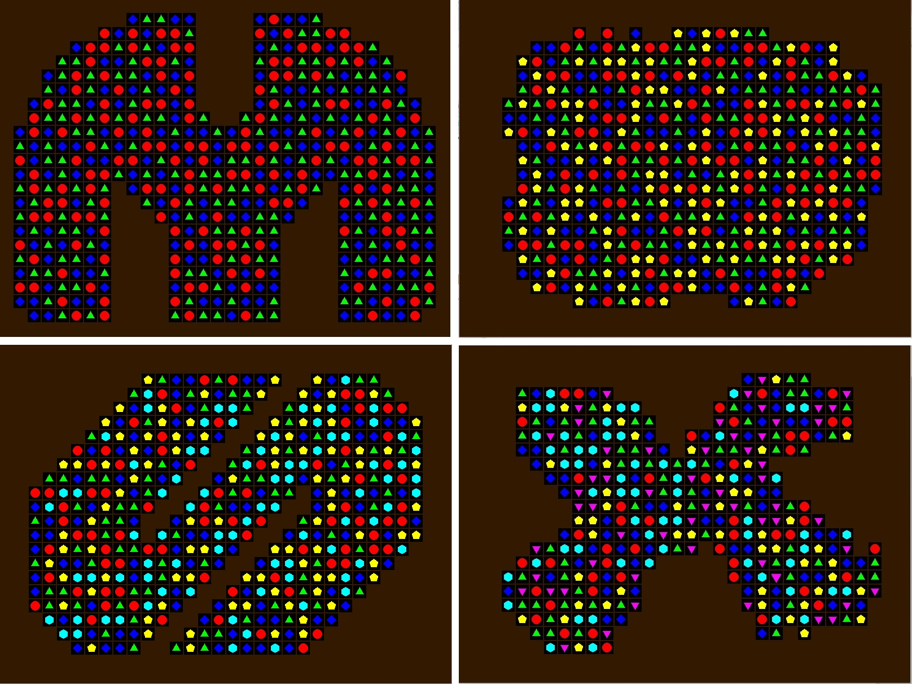

# Match-Three

&nbsp;

Click [here](http://carsoncraig.github.io/jar/MatchThree.jar) to download an executable JAR.

&nbsp;

## Controls:

Switch jewels by selecting a jewel with the left mouse button and dragging the mouse to an adjacent square such that a match is made.

|Control|Purpose|
|:-:|:-:|
|F                         | Toggle Fullscreen Mode|
|S + Left Click            | Change the shape of the board by placing brown squares|
|S + Right Click           | Change the shape of the board by removing brown squares|
|UP | Increase the number of jewels|
|DOWN | Decrease the number of jewels|
|Hold D | Show the state of the board without jewels|
